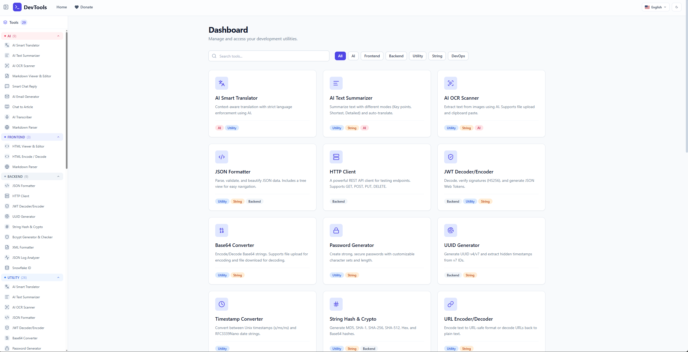

<div align="center">

# VibeTools

**Hộp công cụ all-in-one cho developer. AI utilities và dev tools kinh điển, gói gọn trong một app tự host.**

[](https://go.dev)
[](LICENSE)
[](https://www.docker.com)

[Demo](https://tool.genzdev.net) · [Bắt Đầu](#bắt-đầu) · [AI Tools](#ai-tools) · [Dev Tools](#dev-tools) · [Tự Host](#tự-host) · [Docs](docs/TECHNICAL.md)

</div>

---

VibeTools thay thế 17 tab trình duyệt bạn mở mỗi ngày — JSON formatter, JWT decoder, AI summarizer, HTTP client, v.v. — bằng một app duy nhất tự host. Không tài khoản, không telemetry, không cần internet sau khi cài xong.

**Demo:** [https://tool.genzdev.net](https://tool.genzdev.net)



> English: [README.MD](README.MD)

## Tính Năng

- **30 tools** thuộc hai nhóm AI và developer
- **AI tools** hỗ trợ OpenAI, Google Gemini, hoặc Vertex AI
- **Dev tools** chạy hoàn toàn trên trình duyệt — dữ liệu không rời máy bạn
- **Single binary** — Go backend với React SPA nhúng bên trong
- **Tự host trong vài phút** bằng Docker hoặc từ source
- **Giao diện đa ngôn ngữ** — Tiếng Anh và Tiếng Việt

---

## Bắt Đầu

### Docker

Cách nhanh nhất để chạy:

```sh
docker run -p 8080:8080 ghcr.io/kevinxvu/vibe-tools:latest
```

Mở **http://localhost:8080**

### Từ Source

**Yêu cầu:** Go 1.24+, Docker, [`air`](https://github.com/air-verse/air), [`wire`](https://github.com/google/wire), [`swag`](https://github.com/swaggo/swag)

```sh
git clone git@github.com:kevinxvu/vibe-tools.git
cd vibe-tools

make provision   # Khởi động database container và chạy migration
make dev         # Chạy server với hot reload
```

---

## AI Tools

AI tools gọi tới LLM provider bạn đã cấu hình. Xem [LLM (AI Features)](docs/TECHNICAL.md#llm-ai-features) để thiết lập.

| Tool | Mô tả |
| --- | --- |
| **Chat to Article** | Biến chat log hoặc thread Slack thành bài viết kỹ thuật có cấu trúc. |
| **Text Summarizer** | Tóm tắt nội dung dài theo nhiều phong cách — bullets, đoạn văn, TLDR, executive. |
| **Email Generator** | Soạn email chuyên nghiệp với nhiều giọng điệu từ một brief ngắn. |
| **Smart Chat Reply** | Gợi ý câu trả lời từ chuỗi hội thoại hoặc ảnh chụp màn hình. |
| **AI Transcriber** | Transcript audio hoặc video sang `text`, `json`, hoặc `srt`. |
| **AI Translator** | Dịch có nhận thức ngữ cảnh với ngôn ngữ nguồn/đích và giọng điệu tùy chỉnh. |
| **OCR Tool** | Trích xuất văn bản từ ảnh — screenshot, tài liệu scan, ảnh chụp bảng trắng. |
| **Markdown Format** | Dọn markdown lộn xộn hoặc sai định dạng thành phiên bản nhất quán. |
| **Markdown Parser** | Chuyển đổi HTML, plain text, URL, hoặc file (DOC, XLSX, PDF) sang Markdown sạch. |
| **Mermaid Generator & Live Preview** | Tạo Mermaid diagram từ mô tả, rồi chỉnh source cạnh live preview. |

---

## Dev Tools

Tất cả dev tools chạy cục bộ trên trình duyệt. Không có dữ liệu nào được gửi tới server.

| Tool | Mô tả |
| --- | --- |
| **HTTP Client** | Gửi REST request và kiểm tra response, headers, status codes. |
| **JSON Formatter** | Pretty-print, minify, validate và khám phá JSON dạng cây. |
| **JWT Tool** | Decode JWT để xem claims, hoặc encode token mới với custom secret. |
| **Markdown Viewer** | Editor và preview trực tiếp với cuộn đồng bộ. |
| **HTML Viewer** | Edit và preview HTML trực tiếp với tree view và beautify. |
| **XML Formatter** | Format, minify và khám phá XML dạng cây tương tác. |
| **String Hash** | Tính hash MD5, SHA-1, SHA-256, SHA-512 và Keccak. |
| **Bcrypt Tool** | Hash mật khẩu bằng bcrypt, hoặc xác minh mật khẩu với hash. |
| **String Length Calculator** | Đếm ký tự, từ, dòng và token. Hữu ích để kiểm tra kích thước LLM prompt. |
| **Multiline Converter** | Nối, quote, wrap hoặc biến đổi văn bản nhiều dòng chỉ với một click. |
| **Text Case Converter** | Chuyển đổi giữa camelCase, PascalCase, snake_case, kebab-case, slug và nhiều hơn. |
| **String Escaper** | Escape và unescape cho HTML, XML, JS, JSON, CSV và SQL. |
| **Text Replacer** | Thay thế text theo template với placeholder `{{variable}}`. |
| **HTML Encoder** | Encode và decode HTML entities. |
| **Base64 Converter** | Encode và decode Base64 — text hoặc nội dung file. |
| **URL Converter** | URL-encode và decode chuỗi và query parameters. |
| **Password Generator** | Tạo mật khẩu mạnh với bộ ký tự và độ dài tùy chỉnh. |
| **UUID Generator** | Tạo UUID `v4` và `v7`, kiểm tra các trường của UUID bất kỳ. |
| **Snowflake Generator** | Tạo Snowflake ID và giải mã timestamp cùng machine ID nhúng bên trong. |
| **Timestamp Converter** | Chuyển đổi giữa Unix, milliseconds và datetime RFC3339. |
| **Log Analyzer** | Xem và lọc structured JSON log (SQL, API) dạng bảng gọn gàng. |

---

## Tự Host

### Docker

```sh
docker run -d \
  --name vibe-tools \
  -p 8080:8080 \
  -e LLM_TEXT_MODEL=openai/gpt-5.5 \
  -e LLM_AUDIO_MODEL=openai/gpt-5.5 \
  -e LLM_PROVIDER=openai \
  -e LLM_MAX_INPUT_TOKENS=12000 \
  -e LLM_LIMIT_TOKEN_USAGE=10000000 \
  -e API_BASE_URL="http://localhost:8080" \
  -e OPENAI_API_KEY="your_openai_api_key" \
  -e OPENAI_BASE_URL="your_openai_base_url" \
  ghcr.io/kevinxvu/vibe-tools:latest
```

Mở **http://localhost:8080** sau khi container khởi động.

### Docker Compose

Tạo file `docker-compose.yml`:

```yaml
services:
  vibe-tools:
    image: ghcr.io/kevinxvu/vibe-tools:latest
    container_name: vibe-tools
    ports:
      - "8080:8080"
    environment:
      LLM_TEXT_MODEL: openai/gpt-5.5
      LLM_AUDIO_MODEL: openai/gpt-5.5
      LLM_PROVIDER: openai
      LLM_MAX_INPUT_TOKENS: "12000"
      LLM_LIMIT_TOKEN_USAGE: "10000000"
      API_BASE_URL: "http://localhost:8080"
      OPENAI_API_KEY: "your_openai_api_key"
      OPENAI_BASE_URL: "your_openai_base_url"
    restart: unless-stopped
```

Khởi động app:

```sh
docker compose up -d
```

Thay `OPENAI_API_KEY`, `OPENAI_BASE_URL`, `LLM_TEXT_MODEL`, `LLM_AUDIO_MODEL` bằng giá trị thực tế trước khi expose app. Giữ `API_BASE_URL` rỗng khi frontend nhúng và backend dùng cùng origin.

Xem toàn bộ tùy chọn cấu hình tại [Configuration Reference](docs/TECHNICAL.md#configuration-reference).

---

## Tài Liệu

| Tài liệu | Mô tả |
| --- | --- |
| [docs/TECHNICAL.md](docs/TECHNICAL.md) | Kiến trúc, API reference, hướng dẫn phát triển, triển khai |

---

## Đóng Góp

Mọi đóng góp đều được chào đón. Vui lòng mở issue để thảo luận trước khi gửi pull request.

1. Fork repository
2. Tạo feature branch: `git checkout -b feat/your-feature`
3. Commit thay đổi
4. Mở pull request

Xem [docs/TECHNICAL.md](docs/TECHNICAL.md) để biết chi tiết kiến trúc và cách thiết lập môi trường phát triển.

---

## License

[MIT](LICENSE)
